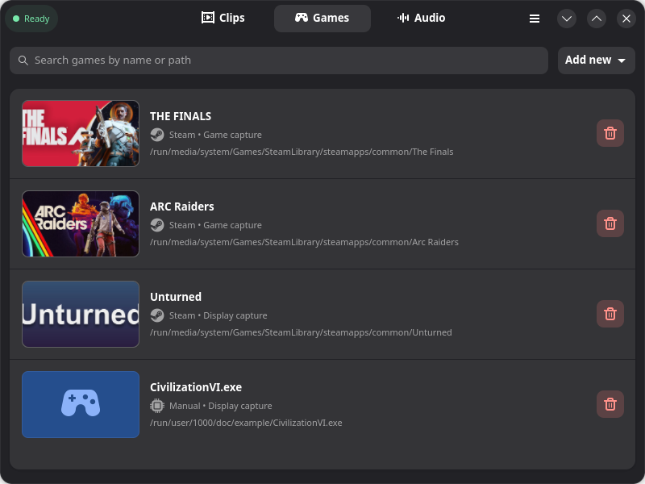
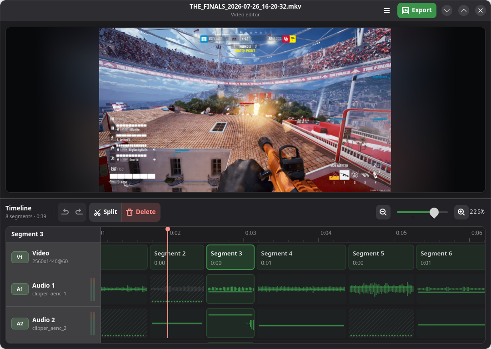
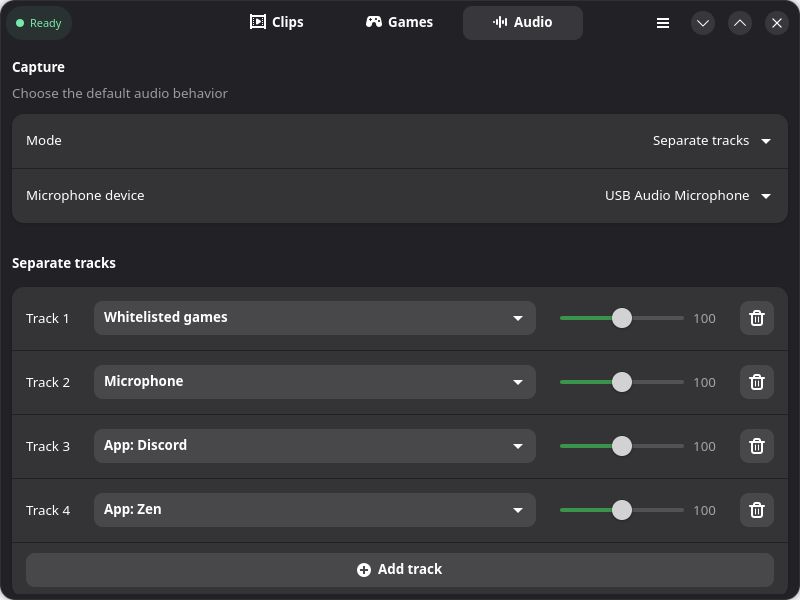
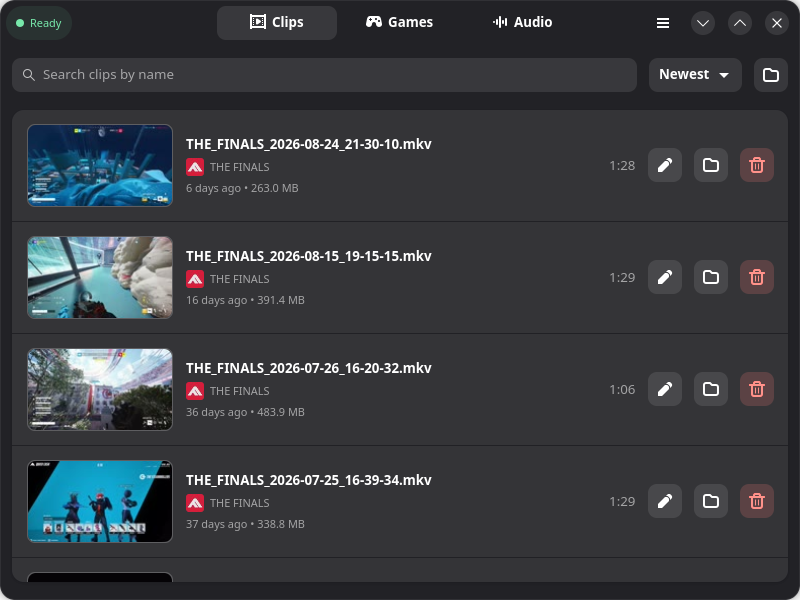

<p align="center">
  <strong>English</strong> ·
  <a href="README.uk.md">Українська</a> ·
  <a href="README.ru.md">Русский</a>
</p>

# Clipper

Clipper is a Linux app for saving clips from your recent gameplay. Add the games
you play, set a hotkey, and press it when something worth keeping happens. As
simple as that.

If you have used NVIDIA ShadowPlay or OBS Studio's Replay Buffer, Clipper works
the same way: it keeps recent gameplay ready to save as a clip.

It is a GTK4/libadwaita app built around OBS/libobs.

## Install

### GitHub Releases

Get the latest Flatpak bundle from
[GitHub Releases](https://github.com/LeeseTheFox/Clipper/releases/latest),
then install the file you downloaded:

```bash
flatpak install --user --bundle path/to/Clipper.flatpak
```

Replace the example path with the bundle's real filename. Clipper will then
appear in your app menu.

### 🚧 Flathub

Flathub support is on the way. Until then, install Clipper from GitHub Releases.

## Major features

### Instant replay, built around your games

Add a game from your Steam library or point Clipper at any executable. Each
game can use dependable display capture or advanced Vulkan/OpenGL game capture.
Clipper keeps the latest stretch of gameplay ready in the background; press
your global hotkey—or use the tray menu—to save it.

<p align="center">
  
</p>

### A video editor made for quick cleanup

Open any saved clip directly in Clipper. Remove unwanted segments without leaving
a trace, mute or adjust the gain of individual audio tracks per segment and undo
changes at any time. Export with your choice of format, codecs, resolution, and
quality to balance video quality and file size.

<p align="center">
  
</p>

### Keep every voice and app on its own track

Use one ready-to-go mix, or route system sound, your microphone, whitelisted
games, and supported applications to separate tracks. Set each level once in
Clipper and keep the flexibility to rebalance or mute sources while editing.

<p align="center">
  
</p>

### Your clips stay easy to find

Clips land in one searchable library with thumbnails, game names, dates,
durations, and file sizes. Play a clip, reveal it in your file manager, open it
in the editor, or remove it without digging through folders.

<p align="center">
  
</p>

## ⚙️ Powered by OBS

[OBS Studio/libobs](https://obsproject.com/) does the heavy lifting: capture,
encoding, and clip saving. Clipper adds game-aware setup, hotkeys, audio
routing, a clip library, and an editor around it.

The Flatpak bundles libobs and the capture plugins it needs. You do not need a
separate OBS Studio installation to use the released app.

## 🕹️ Using Clipper

1. Add a Steam game or any other running process on your deivce.
2. Pick a capture method, then choose the clip length, quality, audio, and
   hotkey you want.
3. Play. Press the hotkey when the moment happens and Clipper saves the clip.

## Requirements

- Linux with Flatpak support.
- A Wayland or X11 desktop session.
- A graphics stack that supports the capture method you choose.

On Wayland, display capture uses the system screen-capture portal and
PipeWire. Advanced game capture uses `obs-vkcapture` for Vulkan/OpenGL titles.
Clipper's Flatpak bundles both 32-bit and 64-bit game hooks. Native Steam
(including SteamOS) and Flatpak Steam need no extra packages or extensions.
Choose Game capture when adding a game; Clipper handles its launch options.
For other native launchers, copy the launch option shown in the process picker.
Game compatibility still depends on the graphics API, driver, and whether the
game permits capture hooks; use display capture where injection is unavailable.

## Build from source

For a native development build:

```bash
python3 -m venv --system-site-packages venv
./venv/bin/python -m pip install --upgrade pip
./venv/bin/python -m pip install -r ui/requirements.txt
make -C engine/src
./clipper
```

That path needs Python 3.10+, the Python venv module, GTK4/libadwaita and
PyGObject development packages, GCC, make, and a locally installed OBS Studio
Flatpak with its OBSVkCapture extension. `--system-site-packages` lets the
virtual environment use the distribution-provided PyGObject bindings. The
standalone Clipper Flatpak bundles its own recording stack.

Run tests, type checking, and linting with:

```bash
./venv/bin/python -m pip install pytest "pyright[nodejs]" ruff
./tools/run_pytest_quiet.sh
```

For the standalone Flatpak, install Flatpak Builder and the GNOME 50 SDK, then
run the bounded build wrapper:

```bash
flatpak install --user flathub org.gnome.Sdk//50 org.flatpak.Builder
./tools/run_flatpak_build_quiet.sh
```

The wrapper also requires `systemd-run`. The first Flatpak build needs network
access and substantial disk space for the pinned OBS/libobs dependency stack;
later builds reuse the local Flatpak Builder cache.

## More detail

- [Engine overview](engine/README.md)
- [UI architecture](ui/README.md)
- [Flatpak packaging notes](packaging/flatpak/README.md)

## 💜 Contributing

Found a bug or have an idea? [Open an issue](https://github.com/LeeseTheFox/Clipper/issues).
Contributions are welcome.

## Credits

The Flatpak includes OBS Studio/libobs, its capture plugins, and other
third-party components. Their notices are in [LICENSE](LICENSE).

## License

Clipper is free software under the [GNU General Public License v3.0 or
later](LICENSE) (GPL-3.0-or-later).
