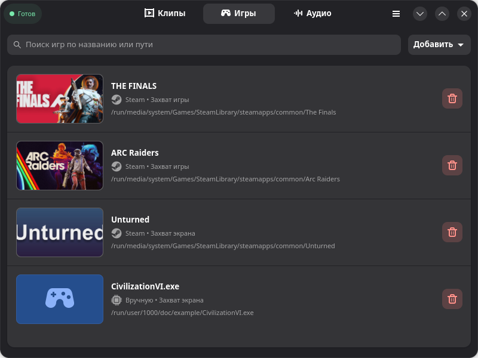
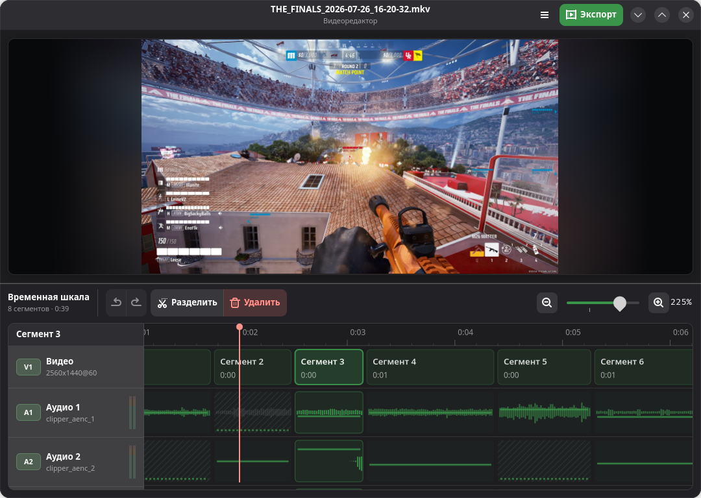
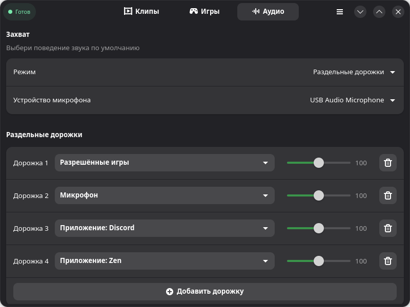
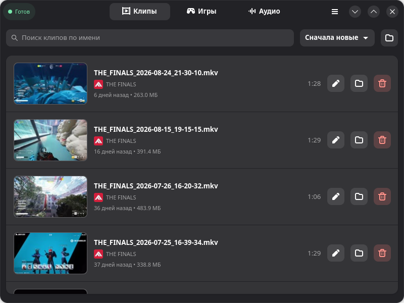

<p align="center">
  <a href="README.md">English</a> ·
  <a href="README.uk.md">Українська</a> ·
  <strong>Русский</strong>
</p>

# Clipper

Clipper — это приложение для Linux, позволяющее сохранять клипы из недавнего
игрового процесса. Добавьте игры, назначьте горячую клавишу и нажмите её, когда
произойдёт что-то стоящее. Просто как никогда.

Если вы пользовались NVIDIA ShadowPlay или Replay Buffer в OBS Studio, Clipper
работает по тому же принципу: он постоянно хранит последние моменты игры,
чтобы их можно было сохранить как клип.

Это приложение GTK4/libadwaita, построенное вокруг OBS/libobs.

## Установка

### Релизы GitHub

Скачайте последнюю версию Flatpak со страницы
[релизов GitHub](https://github.com/LeeseTheFox/Clipper/releases/latest),
затем установите загруженный файл:

```bash
flatpak install --user --bundle путь/к/Clipper.flatpak
```

Замените пример настоящим путём к загруженному файлу. После этого Clipper
появится в меню приложений.

### 🚧 Flathub

Поддержка Flathub ещё в разработке. Пока что устанавливайте Clipper из
релизов GitHub.

## Основные возможности

### Мгновенный повтор для ваших игр

Добавьте игру из библиотеки Steam или укажите путь к любому исполняемому файлу.
Для каждой игры можно выбрать надёжный захват экрана или расширенный захват игр
через Vulkan/OpenGL. Clipper в фоновом режиме хранит последние моменты игры;
нажмите глобальное сочетание клавиш или воспользуйтесь контекстным меню в трее,
чтобы сохранить их.

<p align="center">
  
</p>

### Видеоредактор для быстрой обработки

Открывайте любой сохранённый клип прямо в Clipper. Беспледно удаляйте ненужные
фрагменты, глушите или подстраивайте громкось отдельных аудиодорожок для каждого
фрагмента и отменяйте изменения в любое время. При экспорте выбирайте формат,
кодеки, разрешение и качество, чтобы найти баланс между качеством видео и
размером файла.

<p align="center">
  
</p>

### Каждый голос и приложение на своей дорожке

Используйте готовый общий микс или направляйте системный звук, микрофон, игры
из белого списка и поддерживаемые приложения на отдельные дорожки. Настройте
громкость каждого источника один раз в Clipper, а при редактировании свободно
меняйте баланс или отключайте отдельные источники.

<p align="center">
  
</p>

### Клипы всегда под рукой

Клипы попадают в одну библиотеку с поиском, миниатюрами, названиями игр, датами,
длительностью и размером файлов. Воспроизводите клип, показывайте его в файловом
менеджере, редактируйте или удаляйте — не придётся искать по папкам.

<p align="center">
  
</p>

## ⚙️ Работает на OBS

[OBS Studio/libobs](https://obsproject.com/) берёт на себя основную работу:
захват, кодирование и сохранение клипов. Clipper добавляет настройки с учётом
игр, сочетания клавиш, маршрутизацию аудио, библиотеку клипов и видеоредактор.

Flatpak включает libobs и необходимые плагины захвата. Для использования
готового приложения отдельная установка OBS Studio не нужна.

## 🕹️ Как пользоваться Clipper

1. Добавьте игру из Steam или любой запущенный процесс на своем устройстве.
2. Выберите способ захвата, затем настройте длительность клипа, качество,
   звук и нужное сочетание клавиш.
3. Играйте. Когда произойдёт нужный момент, нажмите сочетание клавиш — Clipper
   сохранит клип.

## Требования

- Linux с поддержкой Flatpak.
- Сеанс рабочего стола Wayland или X11.
- Графический стек с поддержкой выбранного способа захвата.

В сеансе Wayland захват экрана использует системный портал и PipeWire.
Расширенный захват игр использует `obs-vkcapture` для игр на Vulkan/OpenGL.

## Сборка из исходного кода

Для локальной сборки в процессе разработки:

```bash
make -C engine/src
./clipper
```

Понадобятся Python 3.10+, GTK4/libadwaita, GCC, make, локальное окружение
`./venv` и установленный локально Flatpak OBS Studio с расширением
OBSVkCapture. Самодостаточная Flatpak-версия Clipper включает собственный стек
записи.

Запускайте тесты, проверку типов и линтер командой:

```bash
./tools/run_pytest_quiet.sh
```

Соберите Flatpak:

```bash
./tools/run_flatpak_build_quiet.sh
```

## Подробнее

- [Обзор движка](engine/README.md)
- [Архитектура UI](ui/README.md)
- [Примечания по упаковке Flatpak](packaging/flatpak/README.md)

## 💜 Участие в разработке

Нашли ошибку или есть идея? [Сообщите об этом](https://github.com/LeeseTheFox/Clipper/issues).
Будем рады вашему участию.

## Благодарности

Flatpak включает OBS Studio/libobs, его плагины захвата и другие сторонние
компоненты. Их лицензионные уведомления находятся в файле [LICENSE](LICENSE).

## Лицензия

Clipper — свободное программное обеспечение, распространяемое по лицензии
[GNU General Public License версии 3 или более поздней](LICENSE)
(GPL-3.0-or-later).
