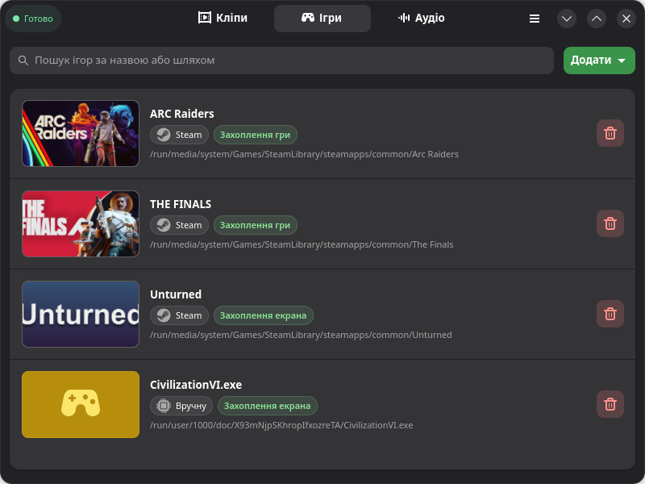
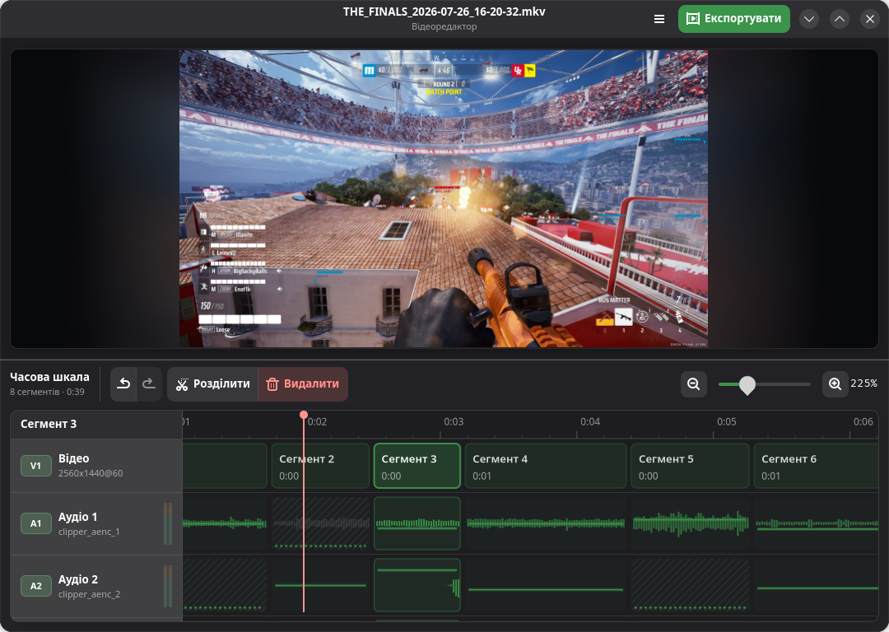
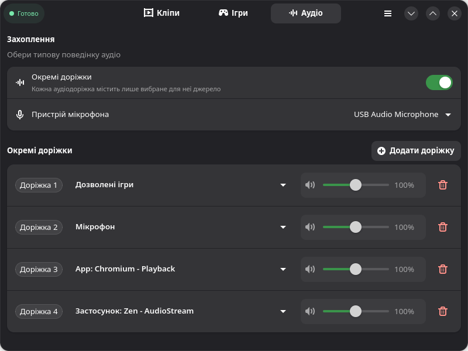
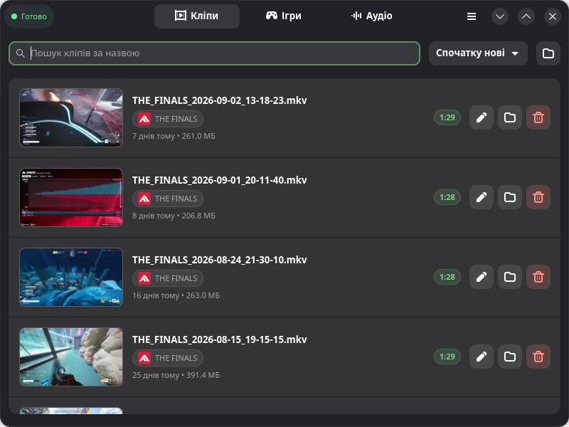

<p align="center">
  <a href="README.md">English</a> ·
  <strong>Українська</strong> ·
  <a href="README.ru.md">Русский</a>
</p>

# Clipper

Clipper — це додаток для Linux, який дає змогу зберігати кліпи вашого геймплею.
Додайте свої ігри, налаштуйте гарячу клавішу й натисніть її, коли
станеться щось варте збереження. Легко як ніколи.

Якщо ви користувалися NVIDIA ShadowPlay або Replay Buffer в OBS Studio,
Clipper працює за тим самим принципом: він тримає напоготові останній відрізок
ігрового процесу, щоб його можна було зберегти як кліп.

Це додаток на GTK4/libadwaita, з OBS/libobs у якості фундаменту.

## Встановлення

### Релізи GitHub

Завантажте найновіший пакет Flatpak зі сторінки
[релізів GitHub](https://github.com/LeeseTheFox/Clipper/releases/latest),
а потім встановіть завантажений файл:

```bash
flatpak install --user --bundle шлях/до/Clipper.flatpak
```

Замініть приклад на справжній шлях до завантаженого файла. Після цього Clipper
з’явиться в меню програм.

### 🚧 Flathub

Підтримка Flathub ще в розробці. А поки встановлюйте Clipper зі сторінки
релізів GitHub.

## Основні можливості

### Миттєвий повтор для ваших ігор

Додайте гру зі своєї бібліотеки Steam або вкажіть шлях до будь-якого виконуваного
файлу. Для кожної гри можна обрати надійне захоплення екрана або розширене
захоплення ігор через Vulkan/OpenGL. Clipper у фоновому режимі зберігає останній
відрізок ігрового процесу; натисніть глобальну гарячу клавішу або скористайтеся
контекстним меню трея, щоб зберегти його.

<p align="center">
  
</p>

### Відеоредактор для швидкого редагування

Відкривайте будь-який збережений кліп безпосередньо в Clipper. Безслідно
видаляйте непотрібні фрагменти, глушіть або підлаштовуйте гучність окремих
аудіодоріжок для кожного фрагмента та скасовуйте зміни в будь-який момент.
Під час експорту обирайте формат, кодеки, роздільну здатність і якість,
щоб знайти баланс між якістю відео та розміром файла.

<p align="center">
  
</p>

### Кожен голос і застосунок на окремій доріжці

Залиште один готовий мікс або спрямовуйте системний звук, мікрофон, додані до
білого списку ігри та підтримувані застосунки на окремі доріжки. Налаштуйте
гучність кожного джерела один раз у Clipper, а під час редагування за потреби
змініть баланс або вимкніть окремі джерела.

<p align="center">
  
</p>

### Кліпи легко знайти

Кліпи потрапляють до єдиної бібліотеки з пошуком, мініатюрами, назвами ігор,
датами, тривалістю та розміром файлів. Відтворюйте кліп, показуйте його в
менеджері файлів, редагуйте або видаляйте — без зайвих пошуків у папках.

<p align="center">
  
</p>

## ⚙️ Працює на OBS

[OBS Studio/libobs](https://obsproject.com/) відповідає за основну роботу:
захоплення, кодування та збереження кліпів. Clipper додає до нього налаштування
з урахуванням ігор, гарячі клавіші, маршрутизацію аудіо, бібліотеку кліпів і
відеоредактор.

Flatpak містить libobs і потрібні плагіни захоплення. Для використання готового
застосунку окремо встановлювати OBS Studio не потрібно.

## 🕹️ Як користуватися Clipper

1. Додайте гру зі Steam або будь який запущений процес на своєму пристрої.
2. Оберіть спосіб захоплення, а потім налаштуйте тривалість кліпу, якість,
   аудіо та потрібну гарячу клавішу.
3. Грайте. Коли станеться потрібний момент, натисніть гарячу клавішу — Clipper
   збереже кліп.

## Вимоги

- Linux із підтримкою Flatpak.
- Сеанс робочого столу Wayland або X11.
- Графічний стек із підтримкою обраного способу захоплення.

У сеансі Wayland захоплення екрана використовує системний портал і PipeWire.
Розширене захоплення ігор використовує `obs-vkcapture` для ігор на
Vulkan/OpenGL.
Flatpak Clipper містить 32- і 64-бітні бібліотеки захоплення. Нативному Steam
(зокрема SteamOS) і Steam із Flatpak не потрібні додаткові пакунки чи розширення.
Обери захоплення гри під час додавання — Clipper налаштує параметри запуску.
Для інших нативних лаунчерів скопіюй параметр із вікна вибору процесу.
Сумісність залежить від графічного API, драйвера й дозволених грою хуків;
якщо впровадження недоступне, використовуй захоплення екрана.

## Збирання з вихідного коду

Для локального збирання під час розробки:

```bash
python3 -m venv --system-site-packages venv
./venv/bin/python -m pip install --upgrade pip
./venv/bin/python -m pip install -r ui/requirements.txt
make -C engine/src
./clipper
```

Потрібні Python 3.10+, модуль Python venv, пакунки для розробки GTK4/libadwaita
і PyGObject, GCC, make та встановлений локально Flatpak OBS Studio з розширенням
OBSVkCapture. Параметр `--system-site-packages` дає віртуальному середовищу змогу
використовувати надані дистрибутивом прив'язки PyGObject. Самодостатній Flatpak
Clipper містить власний стек запису.

Запустіть тести, перевірку типів і лінтер:

```bash
./venv/bin/python -m pip install pytest "pyright[nodejs]" ruff
./tools/run_pytest_quiet.sh
```

Для самодостатнього Flatpak установіть Flatpak Builder і GNOME SDK 51, а потім
запустіть обмежений за ресурсами скрипт збирання:

```bash
flatpak install --user flathub org.gnome.Sdk//51 org.flatpak.Builder
./tools/run_flatpak_build_quiet.sh
```

Скрипту також потрібен `systemd-run`. Для першого збирання Flatpak необхідні
доступ до мережі та значний обсяг дискового простору для закріпленого стека
залежностей OBS/libobs; наступні збирання використовують локальний кеш Flatpak
Builder.

## Докладніше

- [Огляд рушія](engine/README.md)
- [Архітектура UI](ui/README.md)
- [Нотатки про пакування Flatpak](packaging/flatpak/README.md)

## 💜 Участь у розробці

Знайшли помилку або маєте ідею? [Повідомте про це](https://github.com/LeeseTheFox/Clipper/issues).
Долучайтеся до розробки.

## Подяки

Flatpak містить OBS Studio/libobs, його плагіни захоплення та інші сторонні
компоненти. Ліцензійні повідомлення про них наведено у файлі [LICENSE](LICENSE).

## Ліцензія

Clipper — вільне програмне забезпечення за ліцензією [GNU General Public License
версії 3 або новішої](LICENSE) (GPL-3.0-or-later).
